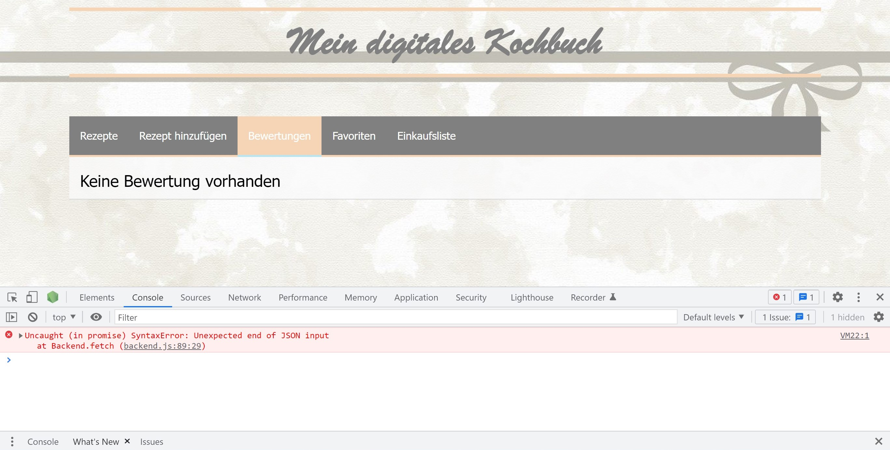

Kochbuch: Frontend
====================

Inhaltsverzeichnis
------------------

 1. [Kurzbeschreibung](#kurzbeschreibung)
 1. [Start mit Docker Compose](#start-mit-docker-compose)
 1. [Node.js-Kommandozeilenbefehle](#nodejs-kommandozeilenbefehle)
 1. [Node.js in Docker ausführen](#nodejs-in-docker-ausführen)
 1. [Produktives Container Image bauen](#produktives-container-image-bauen)
 1. [Dokumentation eines spezifischen Fehlers](#dokumentation-eines-spezifischen-fehlers)


Kurzbeschreibung
----------------

Dies ist die clientseitige Single Page App mit dem Frontend des Kochbuchs.
Es handelt sich dabei um eine einfache Webanwendung, die mit VanillaJS
(also einfachem JavaScript) ohne zusätzlichem Framework realisiert wurde.

Start mit Docker Compose
------------------------

Am einfachsten lässt sich die App mit Docker Compose aus dem Wurzelverzeichnis
heraus starten. Das dort abgelegte README beschriebt die dafür notwendigen
Befehle im Detail:

 * `docker-compose -f docker-compose.dev.yml up -d` zum Starten aller Dienste
 * `docker-compose -f docker-compose.dev.yml down` zum Stoppen aller Dienste
 * `docker system prune` zum Aufräumen nicht mehr benötigter Dateien

Die nachfolgenden Abschnitte in dieser Datei beschreiben hingegen, was dabei im
Hintergrund passiert bzw. wie das Frontend mit und ohne Docker isoliert gestartet
werden kann.

Node.js-Kommandozeilenbefehle
-----------------------------

Diese App nutzt Node.js und den esbuild-Bundler zur Verwaltung von Abhängigkeiten
(im Quellcode verwendete, externe Bibliothekten und Frameworks) sowie zum Bauen
einer deploybaren Version. Hierfür werden die folgenden Kommandozeilenbefehle
bereitgestellt:

 * `npm install` zur Installation aller benötigten Module
 * `npm update` zur Aktualisierung aller Abhängigkeiten
 * `npm start` zum Starten eines Entwicklungsservers auf Port 8080
 * `npm run build` zum Bauen der Anwendung für den Produktivbetrieb
 * `npm run clean` zum Löschen des Build-Verzeichnisses

Änderungen am Quellcode werden sofort aktiv. Es muss lediglich die Seite im
Browser neugeladen werden.

Die mit `npm run build` gebaute Anwendung wird im Verzeichnis `build` abgelegt
und kann von dort auf einen beliebigen Webserver hochgeladen werden. Insbesondere
`npm install` und `npm run build` werden daher im `Dockerfile` während dem Bauen
des Container Images ausgeführt. In der `../docker-compose.dev.yml` werden
hingegen die Befehle `npm install` und `npm start` ausgeführt.

Node.js in Docker ausführen
---------------------------

Falls Node.js auf dem eigenen Rechner nicht lokal installiert wurde, kann mit
folgenden Befehlen ein Docker-Container mit Node.js gestartet werden. In diesem
können die oben gezeigten Befehle dann alternativ ausgeführt werden:

```sh
docker network create meindigitaleskochbuch
docker run -it --net meindigitaleskochbuch -p 8080:8080 -w /app -v "$(pwd):/app" node:17-alpine sh
```

Der erste Befehl muss dabei nur einmalig ausgeführt werden, um ein virtuelles
Netzwerk zur Kommunikation mehrere Container untereinander anzulegen. Streng
genommen wird dieses für das Frontend nicht benötigt. Backend und Datenbank
brauchen es aber, um miteinander "reden" zu können. Der zweite Befehl startet
den Docker-Container mit Node.js. Seine Parameter haben folgende Bedeutung:

  | Parameter                     | Bedeutung                                                                |
  | ------------------------------| -------------------------------------------------------------------------|
  | `run`                         | Es soll ein Docker-Container ausgeführt werden                           |
  | `-it`                         | Start im Vordergrund mit interaktivem Terminal                           |
  | `--net meindigitaleskochbuch` | Container mit dem virtuellen Netzwerk `meindigitaleskochbuch` verbinden  |
  | `-p 8080:8080`                | `localhost:8080` an den Port 8080 des Containers weiterleiten            |
  | `-w /app`                     | Arbeitsverzeichnis `/app` im Container benutzen                          |
  | `-v "$(pwd):/app"`            | Das aktuelle Verzeichnis unter `/app` im Container einbinden             |
  | `node:17-alpine`              | Name des auszuführenden Container-Images (hier Node.js 17)               |
  | `sh`                          | Start einer interaktiven Shell im Container                              |

Innerhalb des Containers wird eine interaktive Shell zur Ausführung der oben
beschriebenen Befehle gestartet. Dabei muss beachtet werden, dass man sich hier
in einer Linux-Umgebung befindet. :-) Mit dem Befehl `exit` kann die Kommandozeile
verlassen werden, wodurch der Container beendet wird, da außer der Shell kein
weiter Prozess in ihm läuft.

Dadurch dass das aktuelle Verzeichnis unter dem Pfad `/app` in den Container
eingebunden wird, hat der Container direkten Zugriff auf den Quellcode der App.
Dementsprechend werden auch alle Dateien, die bei der Installation oder dem
Bauen der App entstehen im lokalen Quellcodeverzeichnis auf dem eigenen Rechner
abgelegt.

Das Gleiche passiert automatisch, wenn im Wurzelverzeichnis mit Docker Compose
die Datei `docker-compose.dev.yml` ausgeführt wird.

Für weitere Informationen siehe
[Docker Getting Started Guide](https://docs.docker.com/get-started/).
Dort findet sich ein ausführliches Tutorial zur Nutzung von Docker während der
Entwicklung, das auch die Grundlage für diese Beschreibung bildet.

Produktives Container-Image bauen
---------------------------------

Für den Produktivbetrieb konfiguriert das beigefügte `Dockerfile` einen
`nginx` Webserver, der in einer beliebigen Cloudumgebung mit Unterstützung
für Containervirtualisierung ausgeführt werden kann. Folgende Befehle werden
hierfür benötigt:

 * `docker build -t meindigitaleskochbuch-frontend .` zum Bauen des Containers
 * `docker run -d -p 8080:80 --net meindigitaleskochbuch --name frontend meindigitaleskochbuch-frontend` zum Ausführen des Containers
 * `docker container stop frontend` zum Stoppen des Containers
 * `docker system prune` zum Aufräumen nicht mehr benötigter Daten

Das `Dockerfile` wird auch verwendet, wenn im Wurzelverzeichnis mit Docker
Compose die Datei `docker-compose.prod.yml` ausgeführt wird. Der Container wird
im Grunde genommen damit auch auf die gleiche Art gestartet.

Dokumentation eines spezifischen Fehlers
---------------------------------

Beim Löschen eines Rezeptes / einer Bewertung / eines Rezeptes auf der Favoritenliste / eines Rezeptes auf der Einkaufsliste
erscheint ein spezifischer Fehler im Frontend:

Uncaught (in promise) SyntaxError: Unexpected end of JSON input
    at Backend.fetch (backend.js:89:29)



Diese Fehlermeldung ist uns bewusst, allerdings konnte die Quelle unsererseits nicht identifiziert und somit nicht gelöst werden.
Da es aber die Funktionalität des Löschens nicht beeinträchtigt wird, wurden hierfür keine Maßnahmen getroffen.
Außerdem ist dieser Fehler bereits im Vorlagen-Grundgerüst "Adressbuch" aufzufinden.
